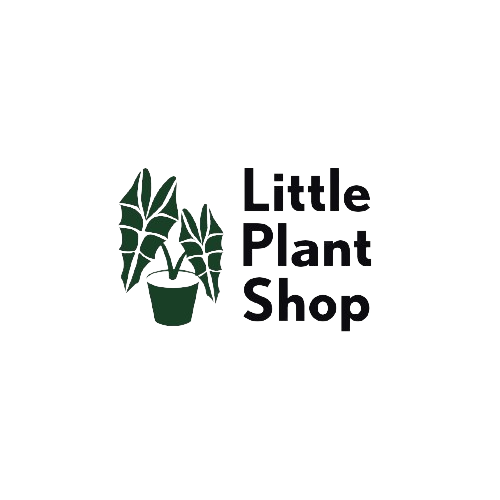

<p align="center" width="100%">
     
</p>

#### Menu
[Nota](#nota)  |

[Vídeo](#Vídeo)  |

[Stack](#stack)  |

[Seções desenvolvidas](#seções-desenvolvidas) |

[Interface](#interface) |

[Jornada do usuário](#jornada-do-usuário) | 

[Api´s](#apis) |

[Heurísticas de Nielsen aplicadas (UX)](#heurísticas-de-nielsen-aplicadas-ux) |

[Links](#links) |

[Dependências](#dependencias) |


# Nota
<p>
    O **Little Plant Store** é um ** App de e-commerce** em desenvolvimento, com React Native . Nesta plataforma, os usuários têm a capacidade de comprar plantas listados em sua plataforma de consoles ou facilmente encontrá-los usando a barra de pesquisa.</P>
    
<p>Durante toda a experiência de navegação, os usuários podem acessar seu perfil e os dados de compras, que são armazenados localmente. Esses dados são encapsulados por meio de **Auth Context** e posteriormente reconhecidos e armazenados em um banco de dados (Strapi). Na plataforma **Strapi**, foram construídas coleções de dados tanto para produtos quanto para regras autenticadas e públicas relacionadas à configuração de perfis de conteúdo individual.</p>

<p> Para facilitar o gerenciamento da API criada na aplicação web, utilizou-se o **Insomnia**, que simplifica os testes de rotas e melhora o desempenho com as **APIs REST**  configuradas com métodos **GET, DELETE e POST** para comunicação entre cliente e servidor.</P>

<P> O layout da aplicação é simples e intuitivo, priorizando a funcionalidade e eficácia, seguindo o princípio de tornar as coisas visíveis, conforme afirmado por **Donald Norman**. </P>

<P> A aplicação web proporciona uma experiência intuitiva aos usuários, incluindo registro/login, alterações de perfil, busca de itens (jogos), compra, gerenciamento do carrinho de compras (**CRUD**), seleção da direção de entrega do produto e integração com a API de pagamento. Tudo isso é projetado com base em boas práticas de **UX**, seguindo as convenções mencionadas por **Steve Krug** e mantendo hierarquias visuais claras. </P>

<P> O código da aplicação está organizado em componentes e hooks, com criação de rotas de API renderizadas usando **React** e **Next Js** como framework, e os estilos são divididos e gerenciados com **Sass**. Além disso, a integração da API do **stripe** permite uma variedade de opções de pagamento e o processamento de pedidos. </P>


# Vídeo


https://github.com/Davidandrade01/little-plant-client/assets/66143693/96f1bd89-09c5-4b5e-a61b-2b72e3cf27fb


## Stack

* JavaScript 

Biblioteca | Framework | Recursos
-----------|---------- |---------
**React**      |**Next.js**    |  Hooks, Context, Components, Props


* Html
    **Formik**
    **yup**

* Css
  * **Sass**
  * **ClassNames**


* Base de Dados para autenticação
  * **Strapi** 

* Integração com Api de pagamento
  * **stripe**


## Seções desenvolvidas

### Interface
- [x] Barra de pesquisa com acesso à api
- [x] Login/Logout
- [ ] Favoritos (por desenvolver)
- [x] Bag/carrinho
- [x]  do carrinho
- [x] Adição e remoção de itens
- [x] Histórico de compras
- [x] Carrossel com cards dos produtos
- [x] detalhes dos produtos(Preço, marca, detalhes)
- [x] Pagamento de compras com Paypal


### Jornada do usuário 

- [x] Login ou registro
- [x] Feedback de erro, ou sucesso
>  Catch
```js

onSubmit:async(formValue)=>{
      try {
       const response=await authCtrl.login(formValue)
      login(response.jwt)
       console.log(response)
       
      } catch (error) {
        console.error(error)
        
        let systemErrorMessage
        if(error.message.includes("password")){
            systemErrorMessage=("Password needs at least 6 characters")
        }}
      }
    }
    
  })
  
  ```
- [x] Busca do item pelo card , ou na barra de pesquisa

>Loading Componente ( Uso de Spinner para indicar busca ao usuário)

```js
{loading &&
      <Loading/>
      }
```      

- [x] Adição de itens no carrinho/remoção

>Quantidade do produto


- [x] Checkout(preenchimento de endereço)
- [x] Pagamento (Conexão com o **stripe**) 
- [x] Conclusão do pedido com visualização dos itens comprados


## Api´s

Api| url
---|---
Desenvolvimento de api e suas Query com o **Insomnia + Strapi**

## Heurísticas de Nielsen aplicadas (UX)

* Estética Minimalista
* Correspondência entre o sistema e o mundo real
* Visibilidade do Status do Sistema
* Consistência e padronização.

## Links

links pessoais  | url
-------------   |------------------
Linkedin        |https://linkedin.com/in/davidandradefrontendreact
Vercel          | 

## Dependências

* classnames: "^2.3.2",
* formik": "^2.4.3"
* jwt-decode: "^3.1.2",
*  "lodash": "^4.17.21",
*  "next": "13.4.19",
*  "react-player": "^2.13.0"
* "react-responsive-carousel",
* "semantic-ui-react"
*"swiper": "^10.3.1",
* "yup": "^1.2.0"
